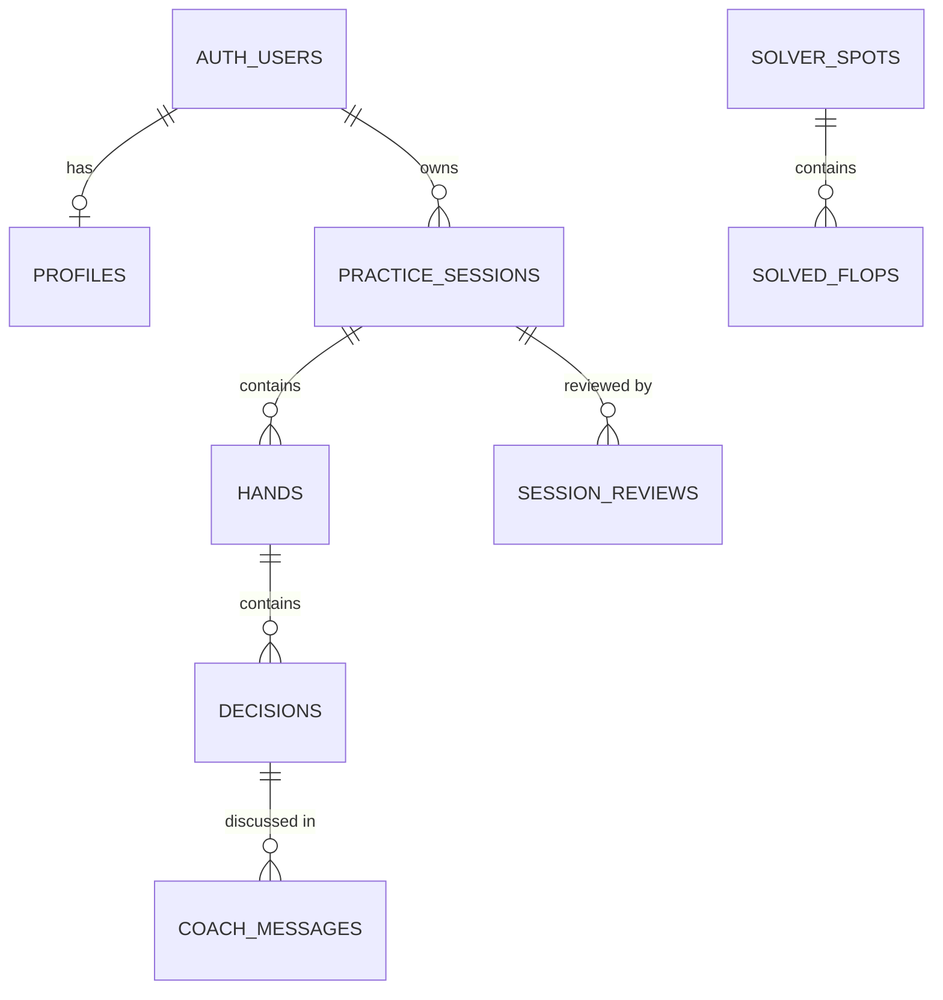

# Database schema (draft for review)

**Status: created in Supabase on 2026-10-04** (migrations `apps/api/drizzle/0000_init.sql` and `0001_security.sql`). The code version is `apps/api/src/db/schema.ts`; change the schema there, run `npm run db:generate -w apps/api`, review the SQL, then `npm run db:migrate -w apps/api`, and update this document. Background and the overall plan are in `docs/accounts-and-data.md`.

## Ground rules

- **Only the API reads or writes these tables.** Row Level Security is switched on for every table with no access rules, so the public Supabase key (the one in the web app) can't read or change anything directly.
- **Every player-owned row has exactly one owner:**
  - `user_id`: a signed-in account, from Supabase's own `auth.users` table. Deleting the account deletes all of its rows.
  - `guest_id`: a random id the browser keeps for someone playing without an account. When a guest signs up, their rows are switched from `guest_id` to `user_id`.
  - The database rejects a row that has both owners or neither.
- **Passwords and sign-in data are not in these tables.** Supabase Auth stores them separately (hashed) in its own `auth` schema.
- **Times** are stored in UTC and shown in the player's local time.

## How the tables relate



Read it as: an account has one profile and many practice sessions; a session has many hands; a hand has many decisions; a decision has a coach conversation. The solver tables stand apart, because they hold shared data, not player data.

### How a session links to its hands

A session doesn't keep a list of its hands. **Each hand points to its session** through its `session_id` column, and each decision points to its hand through `hand_id`:

```
practice_sessions          hands                                    decisions
id = "s-41"      ◄──────   id = "h-1", session_id = "s-41"   ◄──    id = "h-1-d1", hand_id = "h-1"
                 ◄──────   id = "h-2", session_id = "s-41"   ◄──    id = "h-2-d1", hand_id = "h-2"
                                                             ◄──    id = "h-2-d2", hand_id = "h-2"
```

To list a session's hands, the database finds every hand whose `session_id` is "s-41"; an index on that column keeps it fast. This is the standard way to store one-to-many relationships: a session can hold any number of hands, a hand always belongs to exactly one session, and deleting a session deletes its hands and their decisions with it.

## Guest data is temporary

Guests' data lives only for their current session:
- **When a session ends, the guest's rows are deleted:** the session, its hands, decisions, coach messages, and review. A guest session ends when they start a new session, or after **24 hours with no new hand**, since closing a browser tab can't be detected reliably. A cleanup removes those.
- **Signing up during a session keeps it:** that session's hands move to the new account before anything is deleted, and from then on everything is kept.
- Signed-in players' data is kept until they delete their account.

## Player tables

### `profiles`: one row per account

| Column | Type | Required | What it holds | Example |
|---|---|---|---|---|
| `user_id` | uuid, primary key | yes | The account (Supabase auth user) | `7c9e…` |
| `display_name` | text | no | Name shown in the app | `Jordan` |
| `settings` | JSON | yes | Saved preferences: sound, animations, default table, stack, position, skip easy folds, flop practice | `{"sound":true,"heroPosition":"BTN"}` |
| `created_at` | timestamp | yes | When the account first used the app | `2026-10-04 19:40` |

### `practice_sessions`: a sitting of hands

Same idea as today's "session" (the Session review button and "new session").

| Column | Type | Required | What it holds | Example |
|---|---|---|---|---|
| `id` | text, primary key | yes | The session id the browser already creates | `3f2a…` |
| `user_id` / `guest_id` | uuid | one of them | Owner | |
| `started_at` | timestamp | yes | First hand dealt | |
| `ended_at` | timestamp | no | Set when the player starts a new session | |
| `last_active_at` | timestamp | yes | When the last hand was dealt; guest sessions idle for 24 hours are deleted | |

### `hands`: every hand dealt

| Column | Type | Required | What it holds | Example |
|---|---|---|---|---|
| `id` | uuid, primary key | yes | Hand id (already used by the app) | |
| `session_id` | text → `practice_sessions` | yes | Which sitting it belongs to (foreign key; deleting the session deletes the hand) | |
| `user_id` / `guest_id` | uuid | one of them | Owner | |
| `status` | text | yes | `awaiting_hero` (in progress) or `complete` | `complete` |
| `hero_position` | text | yes | Your seat | `BTN` |
| `config` | JSON | yes | Table size and stack depth | `{"tableSize":"SIX_MAX","stackDepthBb":100}` |
| `flop_practice` | boolean | yes | Dealt in flop practice mode | `false` |
| `state` | JSON | no | The game engine's full internal state while the hand is being played: all hole cards, the deck, the action so far. Lets a hand in progress continue after a restart or on another device. Never sent to the browser. **Cleared (set to empty) as soon as the hand completes**: the result and every decision are kept, so history is unaffected. | (large) |
| `result` | JSON | no | Set when the hand completes: the action log plus the final board, showdown, winners, pot and summary. This is the replay that history and the coach use once `state` is cleared. | `{"actionLog":[…],"result":{"board":["Kh","7d",…],"summary":"BTN wins 9.1bb…"}}` |
| `net_bb` | number | no | Your result in big blinds | `4.6` |
| `created_at`, `updated_at`, `completed_at` | timestamp | | When it was dealt, last changed, finished | |

### `decisions`: every graded choice you made

The main table for history, stats, and stars.

| Column | Type | Required | What it holds | Example |
|---|---|---|---|---|
| `id` | text, primary key | yes | Decision id (already used by the app) | `<hand id>-d2` |
| `hand_id` | uuid → `hands` | yes | The hand it happened in | |
| `user_id` / `guest_id` | uuid | one of them | Owner | |
| `idx` | integer | yes | 1st, 2nd, … decision in the hand | `2` |
| `street` | text | yes | `preflop` or `flop` (turn and river later) | `flop` |
| `node_key` | text | yes | The exact spot, used to reload its strategy chart | `FLOP\|btn_vs_bb_srp_100\|Kh7d2c\|0` |
| `spot_type` | text | yes | Category for stats | `FLOP`, `VS_OPEN`, `RFI` |
| `hand_class` | text | yes | Your hand type | `AKo` |
| `hero_cards` | text list | yes | Your exact cards | `{Ah,Kd}` |
| `board` | text list | yes | Board at the time (empty preflop) | `{Kh,7d,2c}` |
| `chosen_action` | text | yes | What you did | `bet` |
| `best_action` | text | yes | Most frequent action in the strategy | `check` |
| `grade` | text | yes | `best`, `mixed`, or `mistake` | `mixed` |
| `chosen_frequency` | number | yes | How often the strategy takes your action (0–1) | `0.32` |
| `feedback` | JSON | yes | The complete verdict as shown (all options, frequencies, EVs), so it replays exactly even if charts change later | |
| `approx_flop` | text | no | Solved flop used when this exact flop isn't solved | `AsTh6d` |
| `hint_used` | boolean | yes | You asked for a hint first | `false` |
| `starred_at` | timestamp | no | **Set when you star the decision; empty when not starred** | `2026-10-04 20:15` |
| `note` | text | no | Your optional note on a decision | `Re-check sizing on wet boards` |
| `tags` | text list | yes (may be empty) | Your labels for filtering, e.g. in "My hands". Free text; the app suggests common ones (sizing, bluff-catch, value, draw, blockers) | `{sizing,draw}` |
| `created_at` | timestamp | yes | When you decided | |

### `coach_messages`: coach explanations and chats

| Column | Type | Required | What it holds | Example |
|---|---|---|---|---|
| `id` | uuid, primary key | yes | Message id | |
| `decision_id` | text → `decisions` | yes | The decision being discussed | |
| `user_id` / `guest_id` | uuid | one of them | Owner | |
| `kind` | text | yes | `explanation` (the Analyze button) or `chat` (follow-ups) | `chat` |
| `role` | text | yes | `user` (your question) or `assistant` (the coach) | `assistant` |
| `tldr` | text | no | The bold one-sentence answer | `Bottom set should bet…` |
| `content` | text | yes | Your question, the coach's detail, or (for an explanation) its points one per line | |
| `points` | JSON | no | Bullet points of an explanation | `["…","…"]` |
| `ungrounded` | JSON | no | Numbers the coach cited that aren't in the data (shown as a warning) | `["90%"]` |
| `created_at` | timestamp | yes | When it was sent | |

Saving explanations means each one is paid for once; reopening a decision shows the earlier answer instead of asking Claude again. An explanation that cites numbers not in the data isn't saved, so it can be regenerated.

### `session_reviews`: saved session reviews

| Column | Type | Required | What it holds |
|---|---|---|---|
| `session_id` | text → `practice_sessions` | yes | The session reviewed |
| `decisions_count` | integer | yes | Decisions at review time (a new review is made only when this changes) |
| `stats` | JSON | yes | Grades, accuracy by spot, leaks, worst mistakes |
| `coach` | JSON | yes | The coach's written summary, leaks, and drill |
| `created_at` | timestamp | yes | When it was generated |

Primary key: `session_id` + `decisions_count`.

### `profile_reviews`: the profile page's all-time coach review

| Column | Type | Required | What it holds |
|---|---|---|---|
| `user_id` | uuid, primary key → `auth.users` | yes | The account (deleted with it) |
| `decisions_count` | integer | yes | The account's decisions when it was written; a new review is made once 25 more have been played |
| `stats` | JSON | yes | The all-time stats it was written from |
| `coach` | JSON | yes | The coach's summary, leaks, and practice suggestion |
| `created_at` | timestamp | yes | When it was written |

One row per account, replaced on refresh. A review that cites numbers not in the stats isn't saved. Added in migration `0002_profile_reviews`.

## Shared solver tables (not player data)

**Unused (2026-10-09).** These tables were made for a plan to keep the solved flop files in Supabase Storage. The files went to S3 instead (see `docs/deployment.md`), and nothing reads or writes these tables. Remove them in a later migration, or reuse them as an index of the S3 files.

### `solver_spots`: one row per preflop spot

| Column | Type | Required | What it holds | Example |
|---|---|---|---|---|
| `name` | text, primary key | yes | Spot name | `btn_vs_bb_srp_100` |
| `chart_version` | text | no | Preflop chart version the ranges came from | `fixture-v2` |
| `spot` | JSON | yes | The full spot definition: ranges, pot, stacks, bet sizes | (contents of `solver/spots/<name>.json`) |
| `created_at` | timestamp | yes | When it was uploaded | |

### `solved_flops`: one row per solved flop

| Column | Type | Required | What it holds | Example |
|---|---|---|---|---|
| `spot` | text → `solver_spots` | yes | Spot | `btn_vs_bb_srp_100` |
| `flop` | text | yes | Canonical flop | `Kh7d2c` |
| `weight` | integer | yes | How many of the 22,100 real flops it stands for | `24` |
| `exploitability_pct_pot` | number | yes | Solve accuracy (lower is better) | `0.84` |
| `tree` | JSON | no | Bet sizes it was solved with | `[["33%","3x"],["66%",""],["75%",""]]` |
| `has_ev` | boolean | yes | File includes per-action EVs | `true` |
| `storage_path` | text | yes | Where the file is | `btn_vs_bb_srp_100/Kh7d2c.json.gz` |
| `bytes` | integer | yes | File size | `41230` |
| `sha256` | text | yes | Checksum, so re-uploads skip unchanged files | |
| `solved_at` | timestamp | yes | When it was uploaded | |

Primary key: `spot` + `flop`.

## Rough sizes

- **Per decision:** about 2–3 KB (mostly the `feedback` JSON).
- **Per hand:** about 5–10 KB while in progress (the engine `state`), about 1 KB once complete (the state is cleared).
- **10,000 hands with 15,000 decisions:** roughly 100–150 MB, well inside the free tier's 500 MB database.
- **Solver files** live in S3 and on the API server's disk, not in Supabase (about 3.6 GB for charts `preflop-v8`).

